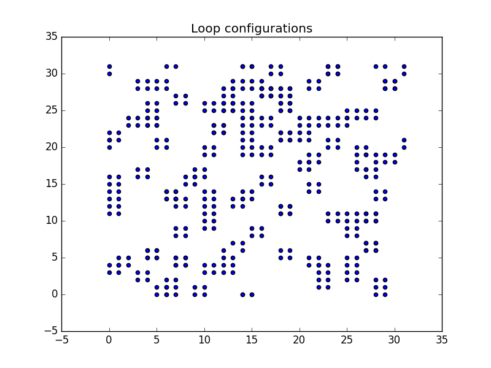
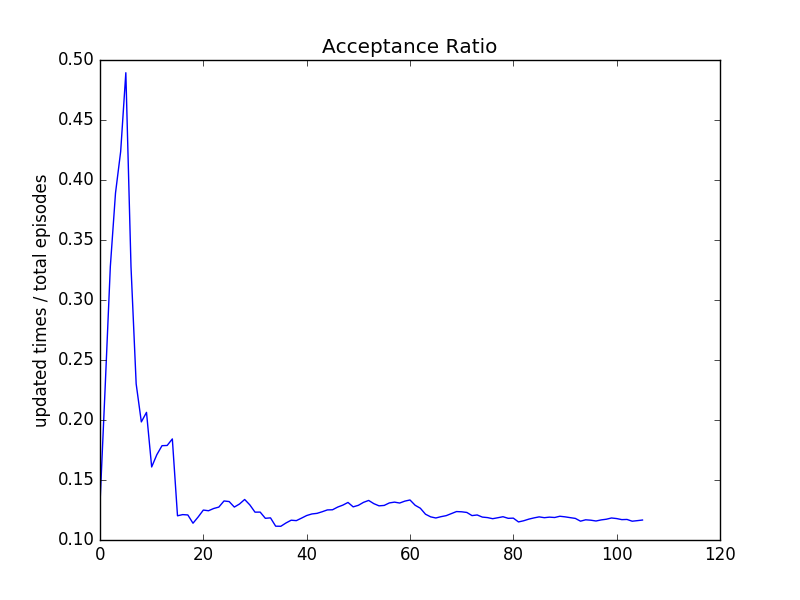
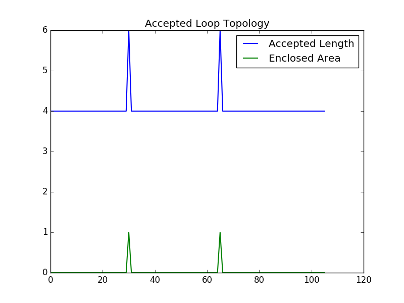

## Tools for analysis

```
python AnalyiseHist.py --logdir /path/to/env_history.json
```

Provide simple functions reading json file and plot the following


### Samples

Show loop configuration


Acceptance ratio (Updated times / Total episodes) wrt time


Loop topoloy, showing thier length and area



### TODO Lists
* Action statistics
* Classify loop config from its area and length
